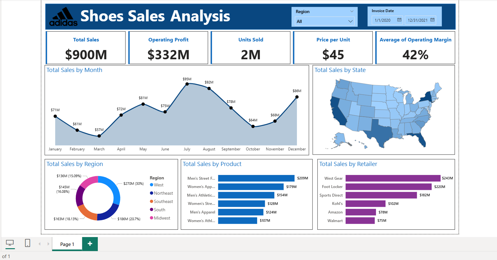

# 👟 Shoes Sales Analysis Dashboard 📊

This project presents an interactive sales analysis dashboard for a fictional shoe company. The goal was to analyze sales performance across different product categories, customer segments, and regions using business intelligence tools.

## 📌 Project Overview

The Shoes Sales Analysis project helps uncover key business insights such as:
- Which product categories and sub-categories perform best
- Regional sales trends
- Profit distribution across different customer segments
- Month-wise performance to identify seasonal patterns

## 📈 Key Features

✅ Sales overview dashboard  
✅ Dynamic filtering by region, segment, category, and date  
✅ KPIs for Total Sales, Profit, and Quantity  
✅ Interactive visualizations including bar charts, line graphs, and heatmaps  
✅ Drill-down capability for detailed exploration

## 🧰 Tools & Technologies

- **Power BI** – For dashboard design and visual storytelling  
- **MS Excel / CSV** – For raw data processing and shaping  
- **DAX** – For calculated fields and advanced measures  
- **Data Cleaning** – Basic preprocessing using Power Query Editor

## 🔍 Insights Generated

- Identified the most profitable regions and customer segments  
- Discovered sales trends that vary by product type  
- Pinpointed months with the highest revenue to guide marketing efforts  
- Provided clear visualizations for strategic business decisions

## 📊 Dashboard Preview

## 🚀 Future Improvements

- Automate data updates from a live source (Excel Online, Google Sheets)  
- Add forecasting using built-in Power BI analytics  
- Include customer demographics for deeper segmentation

